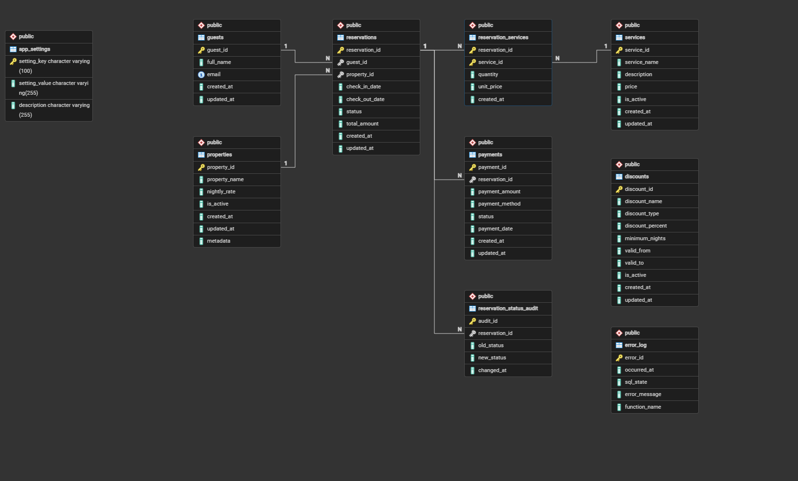

# PostgreSQL Development Lab

> A practical PostgreSQL laboratory focused on writing production-style database code using PL/pgSQL, JSONB, triggers, business rules, and advanced PostgreSQL features.

This project follows the development of a realistic booking platform, implementing business logic directly inside PostgreSQL using production-style database code.

---

## Database Schema



---

Project goals:

- Demonstrate advanced PostgreSQL development techniques.
- Implement business logic directly inside PostgreSQL.
- Explore production-oriented PL/pgSQL patterns.
- Showcase practical use of JSONB, triggers, and advanced database features.
- Serve as a reference for PostgreSQL application development.
- The project is intentionally organized as progressive scenarios, where each topic builds upon previous concepts.

---

## Installation

### Requirements

- Git
- PowerShell 7+
- PostgreSQL 17 (or compatible)
- pgAdmin, `psql`, or another PostgreSQL client

### Option 1: Run PostgreSQL with Docker

Start a PostgreSQL instance using the provided Docker Compose file:

```bash
docker compose up -d
```

The container will be created with the following default configuration:

- **Database:** `postgresql_development_lab`
- **Username:** `postgres`
- **Password:** `postgres`
- **Port:** `5432`

### Build the Project

Run the build script to generate the consolidated installation file:

```powershell
./tools/build-all.ps1
```

This generates:

```text
install/
└── postgresql-development-lab.sql
```

### Install the project

Open the generated script in pgAdmin (or your preferred PostgreSQL client) and execute:

```text
install/postgresql-development-lab.sql
```

### Explore the examples

After the installation completes, execute the scripts located in the `examples` directory to see the implemented functions and procedures in action.

```text
examples/
├── 01_plpgsql_fundamentals.sql
├── 02_business_rules.sql
├── 03_triggers_and_auditing.sql
├── 04_error_handling_and_logging.sql
├── 05_advanced_types.sql
└── 06_jsonb.sql
```
---

# Topics Covered

## Core Database Design

- Relational schema design
- Constraints
- Foreign keys
- Custom types
- Seed data

## PL/pgSQL

- Functions
- Procedures
- Variables
- Control structures
- Loops
- Exception handling
- Composite types

## Business Rules

Examples include:

- Booking validation
- Availability checking
- Stay cost calculation
- Weekly discounts
- Guest booking limits
- Reservation management

## JSONB

Examples of:

- JSONB updates
- Nested JSON manipulation
- JSON arrays
- Metadata storage

## Advanced Types

- Composite types
- Arrays
- FOREACH loops
- Record variables

## Triggers & Auditing

- Automatic auditing
- Change history
- Trigger-based business logic

## Error Handling

- Custom exceptions
- Validation rules
- Defensive programming

---

# Project Structure

```
.
├── examples
│ ├── 01_plpgsql_fundamentals.sql
│ ├── 02_business_rules.sql
│ ├── 03_triggers_and_auditing.sql
│ ├── 04_error_handling_and_logging.sql
│ ├── 05_advanced_types.sql
│ └── 06_jsonb.sql
│
├── install
│ ├── 01_schema.sql
│ ├── 02_plpgsql_fundamentals.sql
│ ├── 03_business_rules.sql
│ ├── ...
│ └── postgresql-development-lab.sql
│
├── schema
│ ├── 00_custom_types.sql
│ ├── 01_core_schema.sql
│ └── 02_core_seed.sql
│
├── scenarios
│ ├── 01_plpgsql_fundamentals
│ │ ├── 01_validate_booking_dates.sql
│ │ ├── 02_calculate_stay_cost.sql
│ │ └── ...
│ │
│ ├── 02_business_rules
│ ├── 03_triggers_and_auditing
│ ├── 04_error_handling
│ ├── 05_advanced_types
│ └── 06_jsonb
│
├── tools
│ └── build-all.ps1
│
└── README.md
```

---

# Current Scenarios

| Scenario | Status |
|-----------|--------|
| PL/pgSQL Fundamentals | ✅ |
| Business Rules | ✅ |
| Triggers & Auditing | ✅ |
| Error Handling | Planned |
| Advanced Types | ✅ |
| JSONB | ✅ |


---

# Technologies

- PostgreSQL
- PL/pgSQL
- JSONB
- Docker
- PowerShell (build scripts)

---

# Future Topics

Additional scenarios may be added over time as the laboratory evolves.

---

# License

MIT